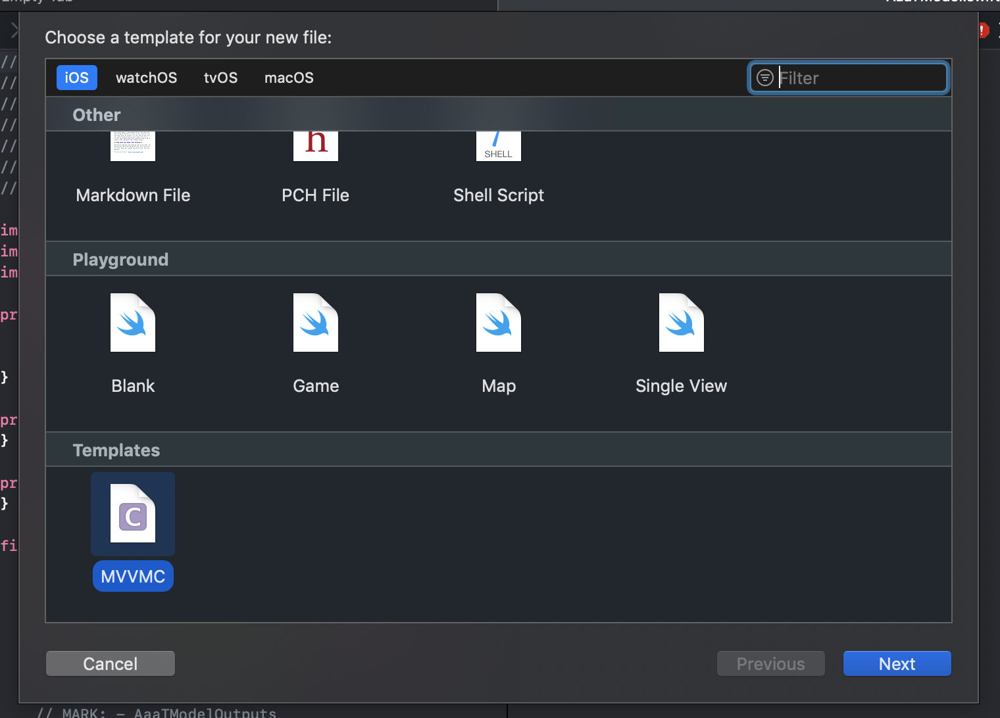
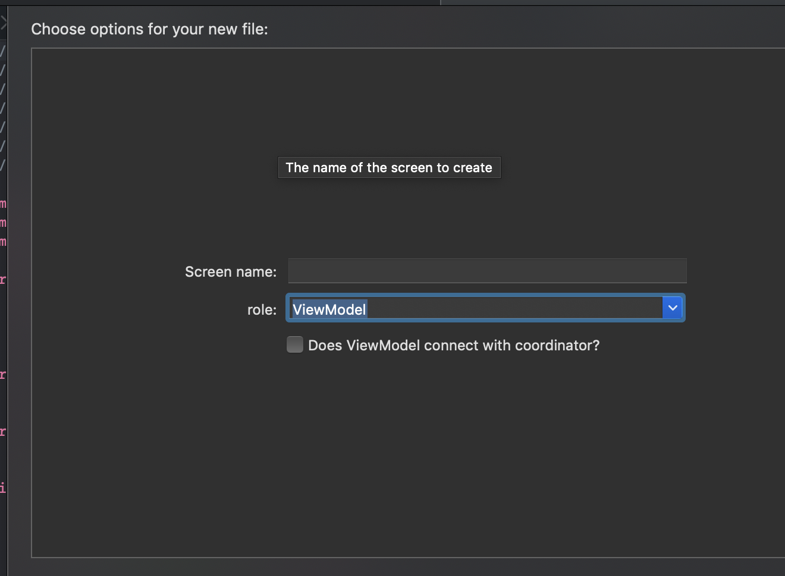

# MVVMC-template

generate MVVMC template.  
And we can use this template as Xcode template by copying [MVVMC.xctemplate](https://github.com/ezura/MVVMC-template/tree/master/MVVMC.xctemplate) into ~/Library/Developer/Xcode/Templates.

  

## generated files
* Coordinator
* CoordinatorTests
* Model
* ViewController
* ViewModel
  - protocol
    - ~ViewModeling
    - inputs
    - outputs
    - CoordinatorOutputs

## Installation
### Makefile

```shell
$ git clone git@github.com:ezura/MVVMC-template.git
$ cd MVVMC-template
$ make
```

### [Mint](https://github.com/yonaskolb/mint)

```shell
$ mint install ezura/MVVMC-template
```

## Usage

### Generate files from template

```
$ mvvmc-template generate {Name}
```

### Sort the implementation in the order of declaration in input/output protocol

```
$ mvvmc-template sort-impl {File or directory path}
or
$ mvvmc-template sort-implement {File or directory path}
```

### Options

description | Option
--- | ---
Write copyright in header | `--copyright` or `-C`
Write project name in header | `--project_name` or `-P`
Output files as Xcode template|  `--xcode_template`

If you want to set copyright:

```
$ mvvmc-template generate --copyright "{copyright}" {Name}
or
$ mvvmc-template generate -C "{copyright}" {Name}
```

## tasks
### xctemplate
* [x] [MVVMC.xctemplate](https://github.com/ezura/MVVMC-template/tree/master/MVVMC.xctemplate)

### generate files
* [x] ViewModel
  - [x] protocol
    - ~ViewModeling
    - inputs
    - outputs
    - CoordinatorOutputs
* [x] Coordinator
* [x] CoordinatorTests
* [x] Model
* [x] ViewController

### mode
* [x] sort implement

### improve feature
* [x] header template
* [ ] customize template
* [ ] sync protocol and implement
* [ ] improve error message

## Ref
* [PackageBuilder](https://github.com/pixyzehn/PackageBuilder)
